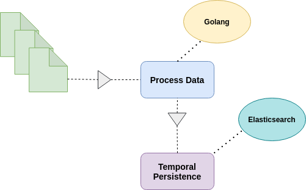

# Processamento de Dados
O projeto tem como principal função ler arquivos de dados, contendo informações de vendas, processar essas informações e armazená-las em uma ferramenta de busca chamado elasticsearch. O diagrama a seguir apresenta o fluxo do processamento dos arquivos.

# Processamento de arquivos
O processamento dos arquivos disponiblizados pelo Bemol, acotecem no arquivo `main.go` que está localizado na pasta `process-data`. A pasta `process-data` é composta por dois subdiretórios , **elasticservice** e **raw_data** .

Na pasta **elasticsearch**, contém um arquivo `elasticservice.py` responsável pela conexão e inserção dos dados no elasticsearch.

Na pasta **raw_data**, contém os arquivos de dados em formatos de : txt, csv, xlsx e html.

# Execução do programa
Para execução do processamento, basta executar o binário `main` com o seguinte comando no terminal:

- `./main`

# Arquivos adicionais
O arquivo `setup.sh` é um arquivo que simula um container do elasticsearch local, usado em testes do programa de processamento. 